# AdventureWorks Analytics — End-to-End Retail BI Platform

> From a CEO's business questions to a production-style data platform: a PostgreSQL star-schema
> warehouse, a tested dbt transformation layer with SCD Type 2 history, a Dockerized Airflow
> pipeline, and a 4-page Power BI report with Row-Level Security — covering 341K+ orders,
> 18K customers, and 15 territories across 2020–2026.

## Highlights

- **Requirements → Model** — translated 6 C-suite business questions into a 2-fact / 6-dim star schema
- **ELT pipeline** — Python loaders (full + incremental) into PostgreSQL `staging`, with per-run logging
- **dbt transformations** — staging views → tested mart tables, seeds, and **SCD Type 2** snapshots for customer & product history
- **Orchestration** — Apache Airflow + Docker Compose, nightly DAG: incremental load → seed → snapshot → run → test
- **Dashboard** — 4-page Power BI report (Executive Summary, Regional Map, Product Drill-through, Customer Detail) with DAX measures and Row-Level Security

---

## 1. The Brief

The project starts from the same place a real analytics engagement does: a set of business
questions from leadership, mapped against the source system to decide what's worth modeling.

| Level | Questions |
|---|---|
| **Executive** | Is the business growing and profitable? Where are we losing money on returns? |
| **Operational** | How is revenue/profit trending MoM and YoY? Which categories and regions drive orders? |
| **Analytical** | Which products have high return rates? Who are our highest-value customers? How does profit respond to price changes? |

These questions were mapped against a simulated Dynamics 365 export to decide exactly which
entities to model — and which to leave out:

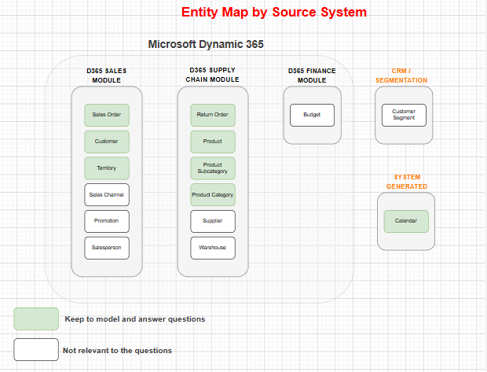

Full list in [`docs/business_questions.md`](docs/business_questions.md).

---

## 2. Data Model — Star Schema

The selected entities became a 2-fact / 6-dim star schema: `fact_sales` and `fact_returns`
at the center, surrounded by `dim_customer`, `dim_product`, `dim_product_category/subcategory`,
`dim_territory`, and `dim_calendar`.

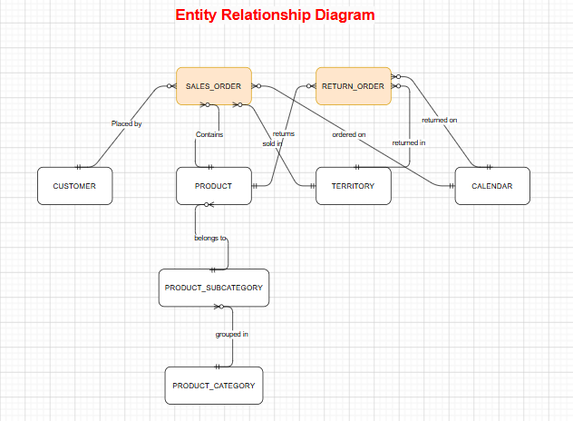

---

## 3. ELT Pipeline — Python → PostgreSQL

Python loaders (`load_full.py`, `load_incremental.py`, `load_dims.py`) read source CSVs and
land them in a PostgreSQL `staging` schema — append-only, with `batch_id`/`loaded_at` stamped
once per run. Every load writes a row to `staging.etl_log`, giving a full audit trail of what
ran, when, and how many rows.

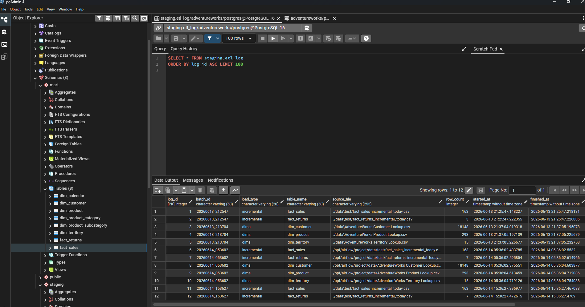

---

## 4. Transformation — dbt + SCD Type 2

dbt turns `staging` into `mart`: typed/cleaned staging views, two seeded static dimensions,
and tested mart tables (28/28 dbt tests passing). `dim_customer` and `dim_product` are built
from `dbt snapshot` — full **SCD Type 2** history on income/marital status/homeowner/occupation
and on product cost/price, with `scd_start_date`, `scd_end_date`, `scd_is_current`, and
`scd_version` on every row.

| Customer history | Product history |
|---|---|
| 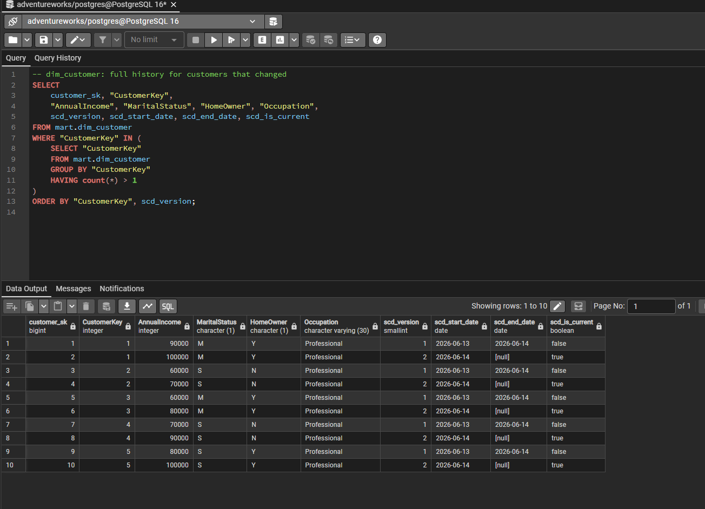 | 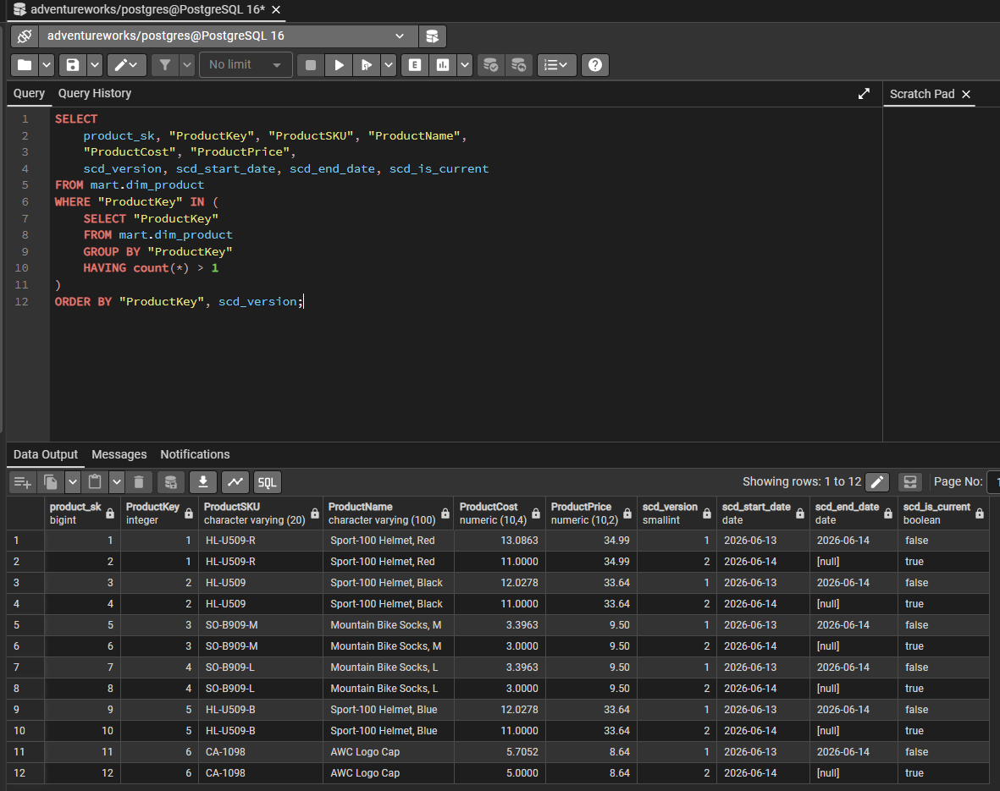 |

---

## 5. Orchestration — Airflow in Docker

A single Airflow DAG, running in Docker Compose, drives the nightly refresh:
`load_facts_incremental` + `load_dims_full` (parallel) → `dbt seed` → `dbt snapshot` →
`dbt run` → `dbt test`. The pipeline is idempotent — re-running it produces zero duplicates
in `mart`, verified across multiple end-to-end runs.

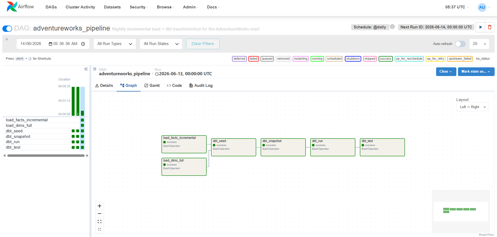

---

## 6. Dashboard — Power BI

`mart` is the only schema Power BI connects to (Import mode). The report has four pages,
each answering one tier of the business questions above, plus Row-Level Security on
`dim_territory[Continent]` / `[Country]`.

**Executive Summary** — revenue, profit, orders, and return rate at a glance, with trend and top products

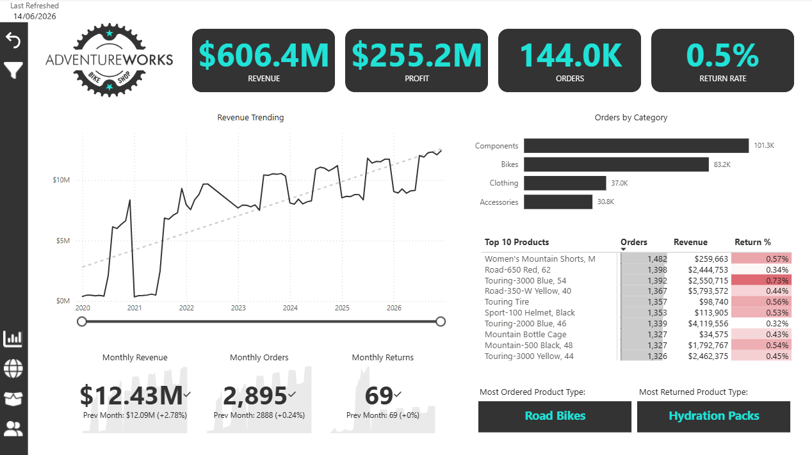

**Regional Map** — orders and revenue by country/continent, filterable by region

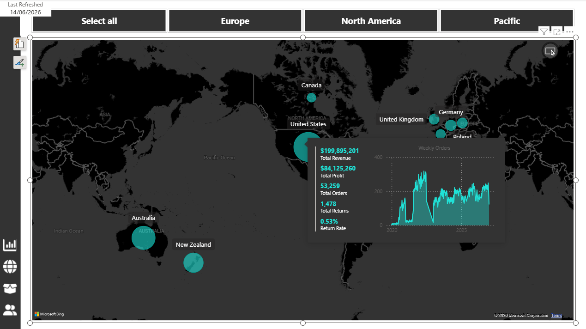

**Product Drill-through** — monthly performance vs. target and profit sensitivity to price changes

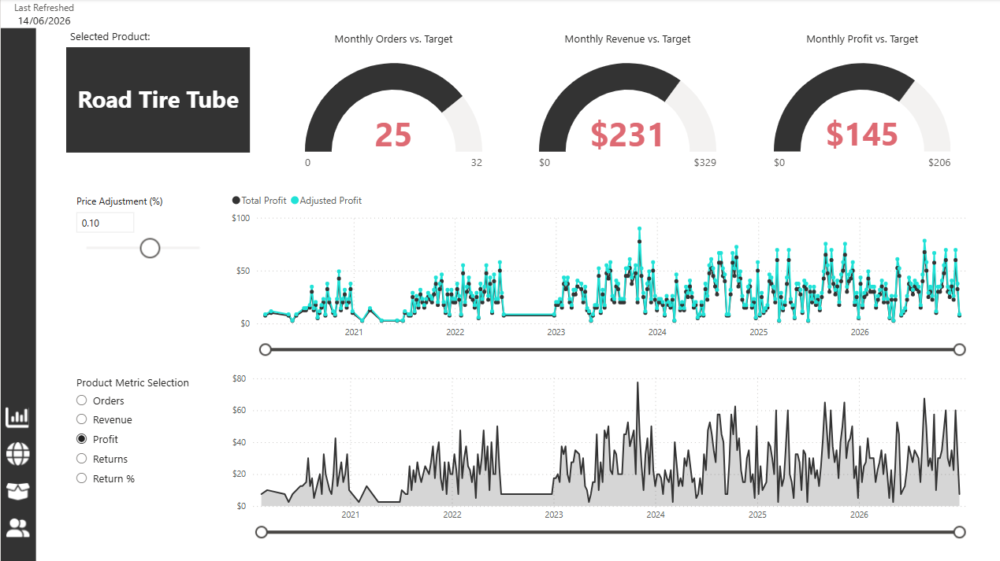

**Customer Detail** — customer value, income/occupation segmentation, and top accounts

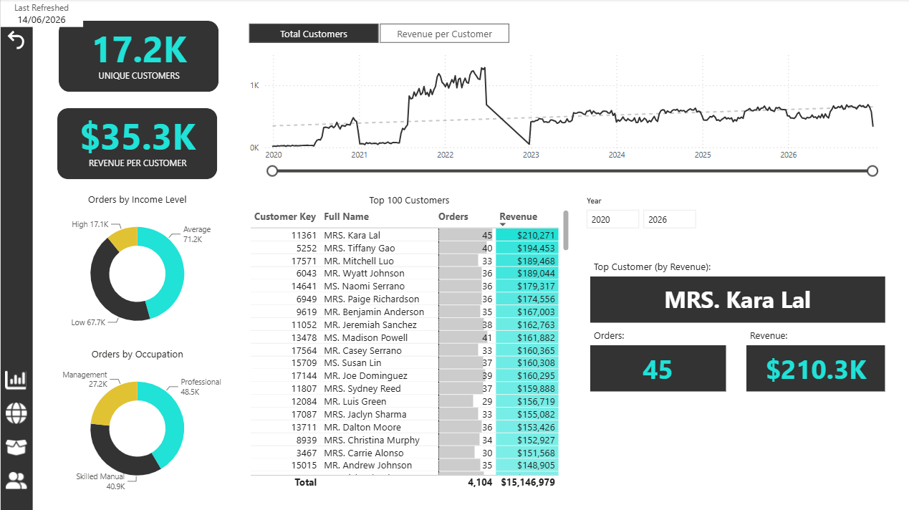

**Semantic model** — relationships between fact and dimension tables in Power BI

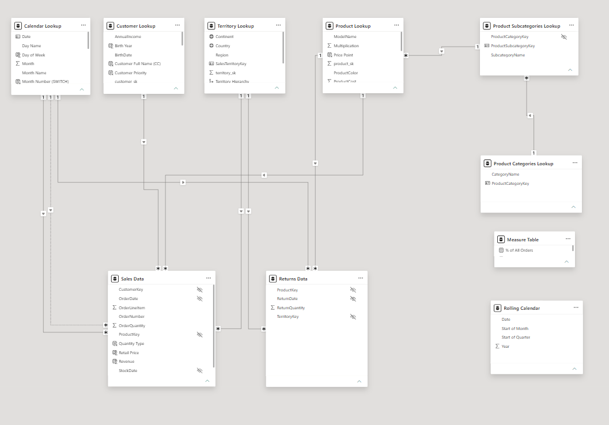

---

## Tech Stack

| Layer | Tool |
|---|---|
| Source | CSV files (simulated D365 export) |
| Database | PostgreSQL 16 |
| Transformation | dbt (staging views → mart tables + snapshots) |
| Orchestration | Apache Airflow + Docker Compose |
| Visualisation | Power BI Desktop → Power BI Service |
| Language | Python 3.11, SQL |

## Documentation

- [`docs/architecture.md`](docs/architecture.md) — design decisions and ADRs
- [`docs/data_dictionary.md`](docs/data_dictionary.md) — table/column reference
- [`docs/business_questions.md`](docs/business_questions.md) — business questions driving the design
- [`CLAUDE-PROGRESS.txt`](CLAUDE-PROGRESS.txt) — phase-by-phase progress tracker

## Project Structure

```
adventureworks-analytics/
├── data/        ← source CSV files (read-only)
├── database/    ← PostgreSQL DDL (staging + mart schemas)
├── loader/      ← Python loaders (full, incremental, dims)
├── utils/       ← shared db connection, logging, file helpers
├── dbt/         ← staging models, mart models, snapshots, seeds, tests
├── airflow/     ← Docker Compose + DAG for orchestration
├── powerbi/     ← Power BI report, DAX measures, RLS setup
└── docs/        ← architecture, data dictionary, business questions, images
```
